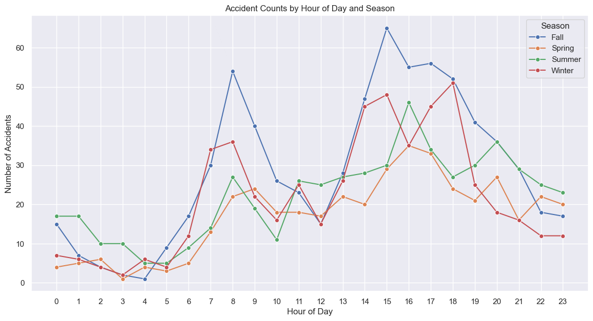

# Exploring the data from the Pedestrian Collisions in Calgary
This notebook is to explore the data, and to try to find an idea for the kind of angle we want to take for the project.

## Data Overview

The dataset contains records of pedestrian-related traffic incidents in Calgary. Initial exploration revealed a wide variety of incident descriptions and some missing values in location and date fields. To enable effective analysis, incident descriptions were standardized and missing quadrant information was derived from latitude and longitude.

```python
raw_data.head()
```


<div>
<table border="1" class="dataframe">
  <thead>
    <tr style="text-align: right;">
      <th></th>
      <th>INCIDENT INFO</th>
      <th>DESCRIPTION</th>
      <th>START_DT</th>
      <th>MODIFIED_DT</th>
      <th>QUADRANT</th>
      <th>Longitude</th>
      <th>Latitude</th>
      <th>Count</th>
      <th>id</th>
      <th>Point</th>
    </tr>
  </thead>
  <tbody>
    <tr>
      <th>0</th>
      <td>51 Street and 32 Avenue SW</td>
      <td>There is an incident involving a pedestrian- E...</td>
      <td>2025/09/19 04:27:58 PM</td>
      <td>2025/09/19 05:41:22 PM</td>
      <td>SW</td>
      <td>-114.160961</td>
      <td>51.025437</td>
      <td>1</td>
      <td>2025-09-19T16:27:5851.02543656008146-114.16096...</td>
      <td>POINT (-114.16096074903503 51.02543656008146)</td>
    </tr>
    <tr>
      <th>1</th>
      <td>Charleswood Drive and Cherokee Drive NW</td>
      <td>There is an incident involving a pedestrian- E...</td>
      <td>2025/09/19 07:57:28 AM</td>
      <td>2025/09/19 08:17:19 AM</td>
      <td>NW</td>
      <td>-114.121819</td>
      <td>51.085713</td>
      <td>1</td>
      <td>2025-09-19T07:57:2851.0857131601675-114.121819...</td>
      <td>POINT (-114.12181911764277 51.0857131601675)</td>
    </tr>
    <tr>
      <th>2</th>
      <td>4 Avenue and 68 Street NE</td>
      <td>There is an incident involving a pedestrian- E...</td>
      <td>2025/09/18 05:13:44 PM</td>
      <td>2025/09/18 05:58:30 PM</td>
      <td>NE</td>
      <td>-113.935036</td>
      <td>51.055767</td>
      <td>1</td>
      <td>2025-09-18T17:13:4451.05576688512121-113.93503...</td>
      <td>POINT (-113.93503593583013 51.05576688512121)</td>
    </tr>
    <tr>
      <th>3</th>
      <td>17 Avenue and 10 Street SW</td>
      <td>There is an incident involving a pedestrian- E...</td>
      <td>2025/09/18 04:23:16 PM</td>
      <td>2025/09/18 04:25:24 PM</td>
      <td>SW</td>
      <td>-114.087039</td>
      <td>51.037813</td>
      <td>1</td>
      <td>2025-09-18T16:23:1651.03781307213497-114.08703...</td>
      <td>POINT (-114.08703931044585 51.03781307213497)</td>
    </tr>
    <tr>
      <th>4</th>
      <td>Nose Hill Drive and John Laurie Boulevard NW</td>
      <td>There is an incident involving a pedestrian- E...</td>
      <td>2025/09/16 06:23:19 AM</td>
      <td>2025/09/16 06:55:34 AM</td>
      <td>NW</td>
      <td>-114.194895</td>
      <td>51.127420</td>
      <td>1</td>
      <td>2025-09-16T06:23:1951.127420365497365-114.1948...</td>
      <td>POINT (-114.19489513405182 51.127420365497365)</td>
    </tr>
  </tbody>
</table>
</div>


```python
raw_data['DESCRIPTION'].nunique()
```


    336


Woah. This means that there are 336 different types of descriptions for the traffic incidents. Let's see the top 25 most common DESCRIPTION values.


```python
raw_data['DESCRIPTION'].value_counts().head(25)
```


    DESCRIPTION
    There is an incident involving a pedestrian.                                                                                  651
    There is an incident involving a pedestrian- EMS on site.                                                                     611
    There is an incident involving a pedestrian- EMS Dispatched.                                                                  272
    There is an incident involving a pedestrian- EMS on site. Blocking the right lane                                              76
    There is an incident involving a pedestrian- EMS on site. Blocking the left lane                                               22
    There is an incident involving a pedestrian. Blocking the right lane                                                           19
    There is an incident involving a pedestrian- EMS on site.  Blocking the right lane                                             19
    Incident involving a pedestrian.                                                                                               15
    There is an incident involving a pedestrian- EMS on site. Blocking multiple lanes                                              12
    There is an incident involving a pedestrian- EMS Dispatched. Blocking the right lane                                           11
    Incident involving a pedestrian                                                                                                 9
    There is an incident involving a pedestrian- EMS on site. Blocking the right lanes                                              8
    There is an incident involving a pedestrian- EMS on site. Blocking the NB right lane                                            7
    There is an incident involving a pedestrian- EMS on site. Blocking the WB right lane                                            7
    There is an incident involving a pedestrian- EMS Dispatched. The road is closed                                                 7
    There is an incident involving a pedestrian.  Blocking the right lane                                                           6
    There is an incident involving a pedestrian. Blocking the left lane                                                             6
    There is an incident involving a pedestrian- EMS on site. Blocking the EB right lane                                            6
    There is an incident involving a pedestrian- EMS on site. Blocking the SB right lane                                            5
    There is an incident involving a pedestrian- EMS on site. The road is closed in all directions, please use alternate route      5
    There is an incident involving a pedestrian- EMS on site. Blocking multiple lanes in the intersection                           4
    There is an incident involving a pedestrian. Blocking the left lane.                                                            4
    There is an incident involving a pedestrian- EMS on site. Blocking the SB left lane                                             4
    There is an incident involving a pedestrian- EMS on site. Blocking the WB left lane                                             4
    There is an incident involving a pedestrian. Blocking the right lanes                                                           4
    Name: count, dtype: int64


Ok, so there is something we can do here. Let's ignore the descriptions that are one-off, and group together all the incidents that are similar.

## Cleaning up the Data

### Cleaning and Normalizing Pedestrian Incident Descriptions  

The raw `DESCRIPTION` field contains many small variations of pedestrian-related incidents.  
For example:  
- `There is an incident involving a pedestrian- EMS on site.`  
- `There is an incident involving a pedestrian- EMS Dispatched. Blocking the right lane`  
- `There is an incident involving a pedestrian. Blocking the left lane`  

All of these should map into broader, standardized categories to simplify analysis.  

I grouped the data into the following main categories:  
- **Pedestrian incident** (general, no further detail)  
- **Pedestrian incident – EMS dispatched**  
- **Pedestrian incident – EMS on site**  
- **Pedestrian incident – EMS involved** (fallback when EMS is mentioned but not clearly “dispatched” or “on site”)  
- **Pedestrian incident – Blocking lanes**  
- **Pedestrian incident – Road closed**  
- **Other** (for unexpected or rare variations)  

I used a rule-based string matching function to map each raw description to one of these categories.  
Any description not matching one of the defined patterns is grouped under **Other**.  


```python
df['DESCRIPTION_CLEAN'].value_counts()
```


    DESCRIPTION_CLEAN
    Pedestrian incident - EMS on site       977
    Pedestrian incident                     715
    Pedestrian incident - EMS dispatched    338
    Pedestrian incident - Blocking lanes     91
    Pedestrian incident - Road closed        27
    Name: count, dtype: int64


There we go. Now we have 5 consistent values for DESCRIPTION stored into a new field.
Let's check for the null values within the dataset next.


```python
df.isna().sum()
```


    INCIDENT INFO          0
    DESCRIPTION            0
    START_DT               0
    MODIFIED_DT          493
    QUADRANT             493
    Longitude              0
    Latitude               0
    Count                  0
    id                     0
    Point                  0
    DESCRIPTION_CLEAN      0
    dtype: int64


### Handling Missing and Irrelevant Data

Missing values in the 'MODIFIED_DT' and 'QUADRANT' columns were addressed. The 'MODIFIED_DT' column can be dropped as it was not essential, and quadrant information can be derived from latitude and longitude coordinates to ensure all incidents could be geographically categorized. Some unnecessary fields were also dropped.


```python
df = df.drop('MODIFIED_DT', axis=1)
df = df.drop('DESCRIPTION', axis=1)
```

Also, the Count field seems to be of no value. Pretty sure it only contains the value one in every row.

```python
df['Count'].nunique()
```


    1

This means there is only one unique value in the Count field, so let's remove it. We can also remove id and Point, since we do not need id for analysis and Point is just redundant geographical data.

After cleaning the data, here is what we get:

```python
df.head()
```


<div>
<table border="1" class="dataframe">
  <thead>
    <tr style="text-align: right;">
      <th></th>
      <th>INCIDENT INFO</th>
      <th>START_DT</th>
      <th>QUADRANT</th>
      <th>Longitude</th>
      <th>Latitude</th>
      <th>DESCRIPTION_CLEAN</th>
    </tr>
  </thead>
  <tbody>
    <tr>
      <th>0</th>
      <td>51 Street and 32 Avenue SW</td>
      <td>2025-09-19 16:27:58</td>
      <td>SW</td>
      <td>-114.160961</td>
      <td>51.025437</td>
      <td>Pedestrian incident - EMS dispatched</td>
    </tr>
    <tr>
      <th>1</th>
      <td>Charleswood Drive and Cherokee Drive NW</td>
      <td>2025-09-19 07:57:28</td>
      <td>NW</td>
      <td>-114.121819</td>
      <td>51.085713</td>
      <td>Pedestrian incident - EMS on site</td>
    </tr>
    <tr>
      <th>2</th>
      <td>4 Avenue and 68 Street NE</td>
      <td>2025-09-18 17:13:44</td>
      <td>NE</td>
      <td>-113.935036</td>
      <td>51.055767</td>
      <td>Pedestrian incident - EMS on site</td>
    </tr>
    <tr>
      <th>3</th>
      <td>17 Avenue and 10 Street SW</td>
      <td>2025-09-18 16:23:16</td>
      <td>SW</td>
      <td>-114.087039</td>
      <td>51.037813</td>
      <td>Pedestrian incident - EMS on site</td>
    </tr>
    <tr>
      <th>4</th>
      <td>Nose Hill Drive and John Laurie Boulevard NW</td>
      <td>2025-09-16 06:23:19</td>
      <td>NW</td>
      <td>-114.194895</td>
      <td>51.127420</td>
      <td>Pedestrian incident - EMS on site</td>
    </tr>
  </tbody>
</table>
</div>


## Exploratory Data Analysis (EDA)


### Finding Trends in Time
Lets split up the seasons to spring, summer, fall, winter.


```python
df["SEASON"].value_counts()
```


    SEASON
    Fall      687
    Summer    530
    Winter    522
    Spring    409
    Name: count, dtype: int64


#### Seasonal Trends in Pedestrian Incidents

Incidents were categorized by season (Spring, Summer, Fall, Winter) based on the date of occurrence. The analysis shows a clear increase in pedestrian accidents during Summer and Fall, with Summer having the highest number of incidents. This suggests that warmer weather and increased outdoor activity may contribute to higher accident rates.
    

    
---
#### Hourly Patterns in Data

By extracting the hour from each incident's timestamp, we observe that accidents most frequently occur around 8am and 3pm. These peaks correspond to typical commuting hours, indicating that pedestrian risk is highest during periods of increased traffic.
    

  
---

#### Yearly and Seasonal Variation

Grouping incidents by year and season reveals how accident patterns persist or change over time. The visualization highlights consistent seasonal trends and allows for the identification of any anomalies or shifts in incident frequency across years.
    

  
---

#### Weekday vs. Weekend Analysis

Incidents were classified as occurring on weekdays or weekends. The majority of pedestrian accidents happen on weekdays, likely due to higher pedestrian and vehicle activity during workdays. This insight can inform targeted safety interventions.

    

    
---

### Finding Trends in Type of Accident
Let's see what types of accidents happen the most, and what to watch out for.

Here are all the different type of accidents there are:
- **Pedestrian incident** (general, no further detail)  
- **Pedestrian incident – EMS dispatched**  
- **Pedestrian incident – EMS on site**  
- **Pedestrian incident – EMS involved** (fallback when EMS is mentioned but not clearly “dispatched” or “on site”)  
- **Pedestrian incident – Blocking lanes**  
- **Pedestrian incident – Road closed**  
- **Other** (for unexpected or rare variations)  

---

#### Distribution of Incident Types

The standardized incident types were analyzed to determine which are most common. General pedestrian incidents are the most frequent, while incidents involving EMS or road closures are less common. This distribution provides context for prioritizing safety measures.
    

    
---

#### Incident Type Patterns by Time and Season

Heatmaps were used to visualize the distribution of incident types across hours of the day and seasons. No strong patterns emerged, suggesting that further data (such as medical records) may be needed to uncover deeper insights into the nature and severity of incidents.
    

    


    

    


## Conclusion

This analysis highlights clear temporal and seasonal patterns in pedestrian collisions, with most incidents occurring during peak travel times and warmer months. While incident type categorization enables cleaner analysis, integrating additional data sources could provide more actionable insights for improving pedestrian safety in Calgary.
