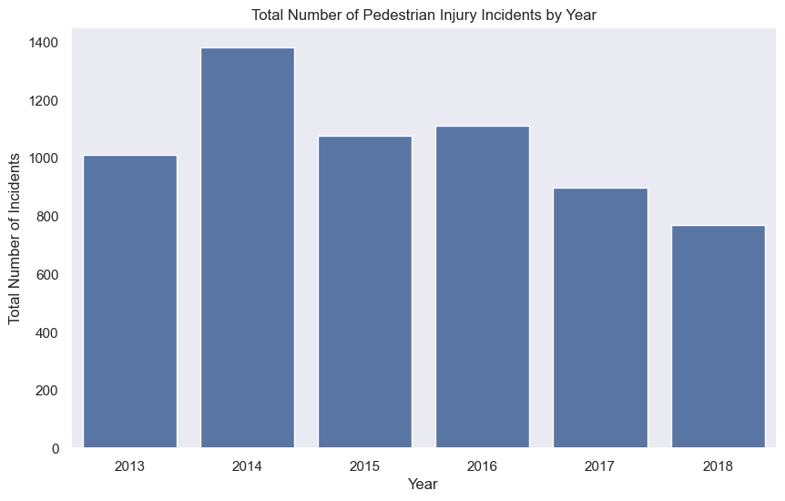
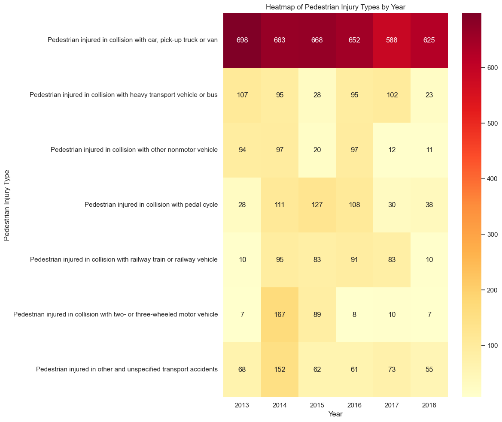
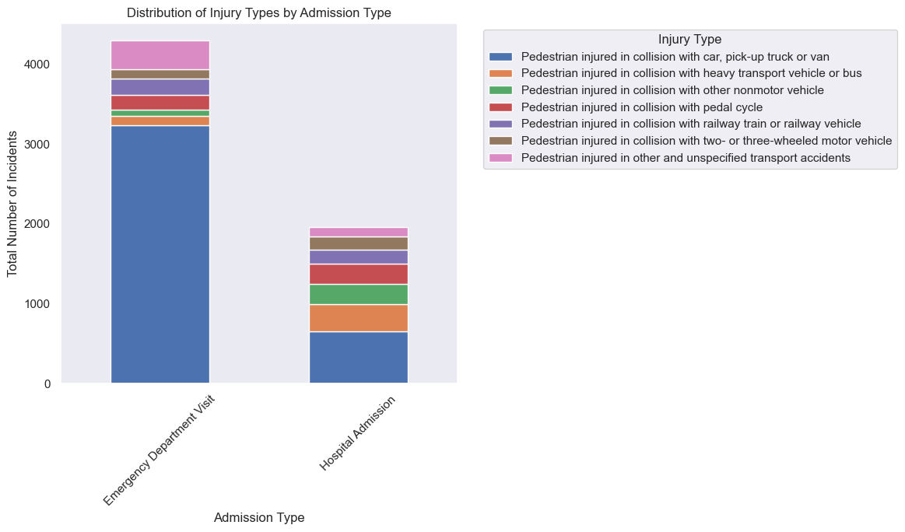
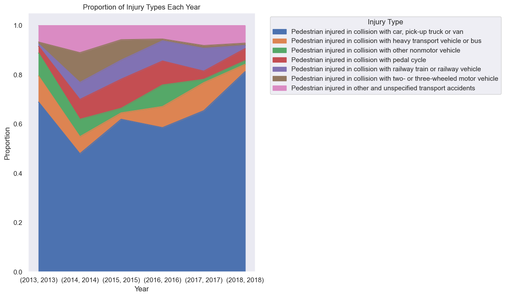

# Exploring the Data from Pedestrian Injuries

This notebook will explore another dataset with the types of pedestrian accident injuries.

## Data Overview
The dataset contains records of pedestrian injuries resulting from various types of collisions, categorized by admission type (Emergency Department Visit or Hospital Admission), year, and injury type. Initial exploration shows the data covers years 2013–2018 and includes several distinct injury categories.


```python
raw_data.head()
```

<div>
<table border="1" class="dataframe">
  <thead>
    <tr style="text-align: right;">
      <th></th>
      <th>Admission Type</th>
      <th>Year</th>
      <th>Pedestrian Injury Type</th>
      <th>Count</th>
    </tr>
  </thead>
  <tbody>
    <tr>
      <th>0</th>
      <td>Emergency Department Visit</td>
      <td>2013</td>
      <td>Pedestrian injured in collision with car, pick...</td>
      <td>582.0</td>
    </tr>
    <tr>
      <th>1</th>
      <td>Emergency Department Visit</td>
      <td>2014</td>
      <td>Pedestrian injured in collision with car, pick...</td>
      <td>555.0</td>
    </tr>
    <tr>
      <th>2</th>
      <td>Emergency Department Visit</td>
      <td>2015</td>
      <td>Pedestrian injured in collision with car, pick...</td>
      <td>555.0</td>
    </tr>
    <tr>
      <th>3</th>
      <td>Emergency Department Visit</td>
      <td>2016</td>
      <td>Pedestrian injured in collision with car, pick...</td>
      <td>545.0</td>
    </tr>
    <tr>
      <th>4</th>
      <td>Emergency Department Visit</td>
      <td>2017</td>
      <td>Pedestrian injured in collision with car, pick...</td>
      <td>488.0</td>
    </tr>
  </tbody>
</table>
</div>


### Data Quality and Preparation

```python
raw_data['Admission Type'].value_counts()
```


    Admission Type
    Emergency Department Visit    42
    Hospital Admission            33
    Name: count, dtype: int64


```python
raw_data['Year'].value_counts()
```

    Year
    2014    14
    2018    14
    2016    13
    2013    12
    2015    12
    2017    10
    Name: count, dtype: int64


Decently clean data for both of these fields, do not need much of data cleaning.

```python
raw_data['Pedestrian Injury Type'].value_counts()
```


    Pedestrian Injury Type
    Pedestrian injured in collision with car, pick-up truck or van              12
    Pedestrian injured in collision with heavy transport vehicle or bus         12
    Pedestrian injured in other and unspecified transport accidents             12
    Pedestrian injured in collision with other nonmotor vehicle                 10
    Pedestrian injured in collision with pedal cycle                            10
    Pedestrian injured in collision with railway train or railway vehicle       10
    Pedestrian injured in collision with two- or three-wheeled motor vehicle     9
    Name: count, dtype: int64

Injury type is also fairly consistent, do not need to make changes to this.


```python
raw_data.isnull().sum()
```


    Admission Type             0
    Year                       0
    Pedestrian Injury Type     0
    Count                     18
    dtype: int64


Seems like there are some null values in Count field. We will fill these in with the mean to keep data consistent.

## Exploratory Data Analysis (EDA)
The data is pretty clean, so we can check in on the analysis


```python
df = raw_data.copy()
df.head()
```

<div>
<table border="1" class="dataframe">
  <thead>
    <tr style="text-align: right;">
      <th></th>
      <th>Admission Type</th>
      <th>Year</th>
      <th>Pedestrian Injury Type</th>
      <th>Count</th>
    </tr>
  </thead>
  <tbody>
    <tr>
      <th>0</th>
      <td>Emergency Department Visit</td>
      <td>2013</td>
      <td>Pedestrian injured in collision with car, pick...</td>
      <td>582.0</td>
    </tr>
    <tr>
      <th>1</th>
      <td>Emergency Department Visit</td>
      <td>2014</td>
      <td>Pedestrian injured in collision with car, pick...</td>
      <td>555.0</td>
    </tr>
    <tr>
      <th>2</th>
      <td>Emergency Department Visit</td>
      <td>2015</td>
      <td>Pedestrian injured in collision with car, pick...</td>
      <td>555.0</td>
    </tr>
    <tr>
      <th>3</th>
      <td>Emergency Department Visit</td>
      <td>2016</td>
      <td>Pedestrian injured in collision with car, pick...</td>
      <td>545.0</td>
    </tr>
    <tr>
      <th>4</th>
      <td>Emergency Department Visit</td>
      <td>2017</td>
      <td>Pedestrian injured in collision with car, pick...</td>
      <td>488.0</td>
    </tr>
  </tbody>
</table>
</div>

---
#### Yearly Trends in Pedestrian Injuries
The bar plot shows the total number of pedestrian injury incidents per year. There is a slight decrease in incidents over time, which may suggest improvements in pedestrian safety or changes in reporting.
    

    
---
#### Injury Types by Year
The heatmap visualizes how different injury types are distributed across years. Most injuries involve collisions with cars, pick-up trucks, or vans, but other types (e.g., collisions with heavy vehicles, pedal cycles, or trains) are also present. The distribution remains fairly consistent year to year.
    

    
---
#### Distribution of Injury Types by Admission Type
Most injuries are treated in the Emergency Department, with a smaller proportion resulting in hospital admissions. The types of injuries leading to hospital admission are similar to those seen in emergency visits, but the counts are lower.
    

    
---
#### Proportion of Each Injury Type per Year
The area plot shows the proportion of each injury type per year. Collisions with cars, pick-up trucks, or vans consistently account for the largest share of injuries, while other types remain relatively stable in proportion.
    

  

## Conclusion
This analysis highlights consistent patterns in pedestrian injury types and admission types over time. Most injuries result from collisions with cars and are treated in emergency departments. While the data is somewhat dated, it provides valuable context for understanding the nature and frequency of pedestrian injuries, which can inform future safety initiatives and resource allocation.